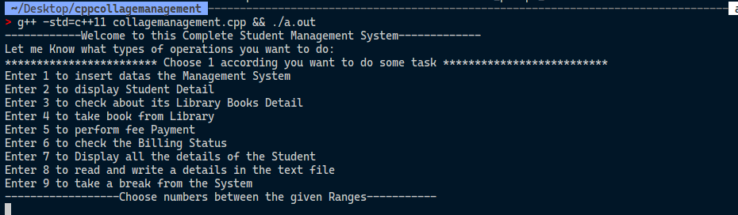

<h1 align="center">Hi 👋, I'm Gajendra Singh</h1>
<h3 align="center">A Passionate CS Explorer!</h3>

  

---

## 💼 About Me
- 👨‍🎓 B.Sc CSIT student  
- 🌱 Passionate about **Full Stack Development, AI/ML, and System Programming**  
- 💻 Focused on building **real-world projects** with modern tech  
- 🚀 Strong OOP, Data Structures, and Algorithms  

---

## 🛠️ Tech Skills

  
   
   
   
   
   
   
   
   
   
   
   
  

---

## 🚀 Projects

| Project | Tech Stack | Demo | GitHub |
|---------|------------|------|--------|
| **Student Management System** | C++ |  | [Code](https://github.com/Gajendra-singh-thakuri/cpp-collagemanagement) |
|

## 📊 GitHub Stats

  
  

  

---

## 📫 Connect with Me

  
  
  

file:///home/thakuri/Pictures/Screenshots/Screenshot%20from%202025-08-31%2009-20-32.png
